# GeLSA: a GPU-accelerated Local Similarity Analysis Tool

Yang Li1, Hongyu Duan1, Shuaishuai Xu2, Yunhui Xiong1, Dongmei Ai3, Shengwei Hou2, Li Charlie Xia1,*

1Department of Statistics and Financial Mathematics, School of Mathematics, South China University of Technology, Guangzhou 510641, China  
2Department of Ocean Science & Engineering, Southern University of Science and Technology, Shenzhen 518055, China  
3Department X, Y, Shenzhen 518055, China  

*Corresponding author(s).  
E-mail: lcxia@scut.edu.cn (Li C. Xia).

## Abstract

agonistic

We introduce GeLSA (GPU-accelerated extended Local Similarity Analysis). This novel multi-core accelerated computing tool enables local similarity analysis (LSA) for large-scale time series data in microbiome and environmental sciences. Compared to the previous most efficient LSA implementation (eLSA), GeLSA achieved over a 100-fold increase in computational efficiency on GPU machines.This is because GeLSA adapted the max sum subarray dynamical programming algorithm for LSA, allowing efficient core-level parallelisation to use modern CPU/GPU architectures. GeLSA also generally accelerates LSA-derived algorithms, including the local trend analysis (LTA), permutation-based MBBLSA, theory-based DDLSA and STLTA methods.As demonstrated by benchmarks, GeLSA maintained the accuracy of those methods while substantially improving their efficiency. Applied to a 72-hour hourly microbiome series tracking nearly thousands of marine microbes, GeLSA revealed intriguing dynamic co-occurrence networks of phytoplankton, bacteria, and viruses in Shenzhen’s Daya Bay. Overall, GeLSA is a versatile and fast tool for large-scale time series analysis, and we have made it freely available for academic use at http://github.com/labxscut/gelsa. 

**KEYWORDS:** Local similarity analysis; GPU acceleration; Time series; Microbiome; Multi-core parallelisation

## Introduction

Understanding the interactions and impacts among factors on ecological or biological systems is essential in biological and environmental sciences. Sequential measurement, as in time series, is an effective way to capture these interactions over time. Traditionally, interesting interactions were primarily detected by using approaches based on the global correlation of pairwise factors over the entire time interval, such as Pearson or Spearman’s correlation. However, real-world biological or environmental data often exhibit more complex interactive relationships and dynamic changes, including local and time-delayed correlations, as observed in various fields such as microbiology [1-4], molecular biology [5,6], and neuroscience [7,8]. Consequently, methods based on global similarity analysis may fail to detect these nuanced relationships.

To address the limitations of global correlation methods, local similarity analysis (LSA) has been introduced [10-13]. LSA is a local alignment method that identifies the best local alignment configuration between two given time series with a maximum delay restriction, thereby detecting local and potentially delayed correlations. Qian et al. initially proposed the LSA method for gene expression analysis [10], which was later adapted for molecular fingerprint data by Ruan et al. [13] and for metagenomics data by Xia et al. [12]. Due to its easy explainability and high effectiveness, LSA has become widely used and highly cited in many areas and has received significant theoretical and practical improvements.  

Significant methodological improvements in LSA include eLSA, a fast C++ implementation and extension of LSA with replicates of data[12]. Later, statistical theories for LSA p-value approximation [9,11] were developed and added to the eLSA tool. More recent improvements, such as Moving Block Bootstrap LSA (MBBLSA) [17] and Data-Driven LSA (DDLSA) [18], were developed for dependent background null models, which are yet to be included in eLSA. A related method is local trend analysis (LTA) [14-16], identifying such local patterns in direction-of-change series. Significant methodological improvements to LTA include Xia et al.'s theoretical approximation of its statistical significance [16], recently refined by Shan et al. termed Steady-state Theory Local Trend Analysis (STLTA) for dependent null background [19], which is yet to be implemented in eLSA.

Recently, we saw a significant expansion in scale and depth of sequencing-based multi-omics time series. This trend has generated an urgent need for more efficient and scalable LSA tools. Before GeLSA, eLSA was the most efficient LSA implementation, allowing pairwise analysis of hundreds to thousands of factors in one day. Specifically, eLSA reaches its daily analytical limit on a personal computer at roughly a hundred factors when the series is short (<20) and permutation is required, and around two thousand factors when the series is long (≥20) and the theoretically approximated p-values could be used. These factor size limits are now routinely challenged as datasets are collected to assess complex biological and environmental systems with high precision. This necessitates the development of faster and more scalable LSA tools.

To address these challenges, we developed GeLSA, a parallel computing tool designed to accelerate the local similarity analysis of time series data. This method leverages the fast-growing multi-core capacity of modern CPUs and GPUs (Rahman & Sakr, 2021; Palleja et al., 2020; Beyer et al., 2021) to optimise the computation process through redesign and parallelisation of the underlying LSA algorithm, significantly reducing the time complexity of computations. By adapting the max sum subarray algorithm to LSA, which allows more efficient core-level computing parallelisation, and taking advantage of multi-core architectures, GeLSA significantly improves the analysis efficiency, achieving approximately 144-fold acceleration On nvidia (RTX2050) compared to eLSA. Specifically, GeLSA can now analyse data series ranging from approximately 1,000 to 10,000 data points daily, depending on the length of the series  by using a commonly available GPU-equipped PC, significantly expanding the analytical capacity for real-world tasks. Moreover, GeLSA integrates and accelerates an expanded set of LSA-derived algorithms, including MBBLSA, DDLSA, and STLTA [17-19], thus generally enabling more efficient time series analysis under autocorrelated and Markovian backgrounds. Overall, it provides researchers with a powerful tool to uncover dynamic interactions in complex biological and environmental systems. 

## Materials and methods

### Simulation Data

To assess the accuracy and efficiency (running time) of GeLSA software in realistic scenarios, we generated two sets of simulated data and conducted comparative analyses against the eLSA tool. In the first dataset, termed simFixLen[n, t], we fixed series length n=100, we randomly sampled m=[20, 40, 60, 80, 100] pairs of independent and identically distributed standard normal valued all of length m. In the second dataset, called simFixSize[m, t], we fixed pairs number m=200 and randomly sampled pairs of independent and identically distributed standard normal values for each series length n=[100, 300, 500, 1000, 1500, 2000, 3000, 4000, 5000, 6000, 7000, 8000, 9000, 10000]. We then used these two simulated datasets in both accuracy and efficiency benchmarks.

### Benchmark Workflow and Evaluation Measures

Since the eLSA tool has already been extensively benchmarked [12] and widely used in real-world data analysis with demonstrated high accuracy and efficiency [11], we used its results as a baseline to compare to GeLSA’s. To be objective, we keep all input data, parameters, and hardware conditions to the tools the same for all the following comparisons.

Because the performance improvement is expected both from adapting the max sum subarray dynamical programming algorithm and employing multi-cores, under the above criteria, we first assessed the algorithms’ running time (in seconds) and the acceleration of GeLSA over eLSA using just one CPU core, using the simulated data of n (series length) =50, m (number of pairs) =[500, 2000, …, 10000] (see Fig. 3a). With the identical sequence lengths but larger scales datasets of n (series length) =50, m (number of pairs) =[5000, 6000, …, 30000], we then assessed the running time and acceleration allowing GeLSA to use a RTX2050 (see Fig. 3c).To examine the computational efficiency improvement of the newly designed algorithm as the sequence length increases while keeping the number of sequence pairs fixed, we measured the running time (in seconds) and the acceleration of GeLSA over eLSA using just one CPU core, using the simulated data of m (number of pairs) =100, n (series length) =[100, 200, …, 1000] (see Fig. 3b). With the identical sequence pairs but larger length datasets of m (number of pairs) =100, n (series length) =[1000, 2000, …, 10000], we then assessed the running time and acceleration allowing GeLSA to use a RTX2050 (see Fig. 3d).

### Acceleration of Improvement Algorithms 

We also set up experiments to assess the acceleration of previous LSA improvement algorithms. P-value evaluation was considered the bottleneck of LSA and the previous research focus, resulting in many published theory- and permutation-based p-value estimation improvements[14-16]. Since GeLSA is accelerating the underlying alignment algorithm using hardware, we can combine it with those improvements to accelerate all those algorithms. 

Following their publications, we implemented those LSA improvements (e.g. BBLSA, DDLSA) in GeLSA. Using the simulation data, we evaluated and compared their efficiency to each other (see Fig. 4a-g). The comparisons were among eLSA using permutation (eLSA_perm) or theoretical (eLSA_theo) p-values, GeLSA using permutation (GeLSA_perm) or theoretical (GeLSA_theo) p-values, GeLSA using the BBLSA (GeLSA_BBLSA) permutation or the DDLSA (GeLSA_BBLSA) theory. 

We also implemented and compared GeLSA’s acceleration of LTA improvement algorithms (e.g., STLTA [19]). The comparisons were among eLTA (LTA by eLSA) using permutation (eLTA_perm) or theoretical (eLTA_theo) p-values, GeLSA using permutation (GeLTA_perm) or theoretical (GeLTA_theo) p-values, and GeLSA using the STLTA (GeLTA_STLTA) theory. Please refer to their corresponding references for details of these p-value estimation improvements.

### Daya Bay Dataset Analysis  

To explore the diel patterns of marine microbiome time-series of Daya Bay, we collected from the Shenzhen Daya Bay (22°659′-22°663′ N, 114°522′- 114°526′ E) between 28-31 October 2021 and consisted of 72-hour high-frequency time series. The time series sampling was conducted about every 2 hours for 3 days, at 3 neighbouring sites A, B and C, spaced 500 meters apart [20].

The Daya Bay dataset consists of ASV (Amplicon Sequence Variants) abundance data sampled at high frequency over 72 hours. We selected 400 abundant ASVs from the Daya Bay dataset, with a minimum relative abundance of 1%, covering up to 97.0% of all ASVs. For the time series, we examined time-lagged correlations with delays of (0 hours, 6 hours, 12 hours, 18 hours, 24 hours, and 48 hours). 

## Results and Discussion

### GeLSA: A Redesigned LSA Algorithm

The main result of this paper is a newly developed multi-core algorithm and software tool named GeLSA (see Alg. 1 and Fig. 1 ). GeLSA consists of two layers of acceleration over eLSA. In the core-level layer, we reduce the original 2-d time series alignment problem, which requires a quadratic O(n^2) time- and space-complexity dynamical programming algorithm (adapted from the Smith-Waterman local sequence alignment algorithm [10-13] and used in eLSA) to 2D+1 max sum subarray subproblems, which has an optimal 1-d dynamical programming algorithm solution in O(n) time- and space-complexity.

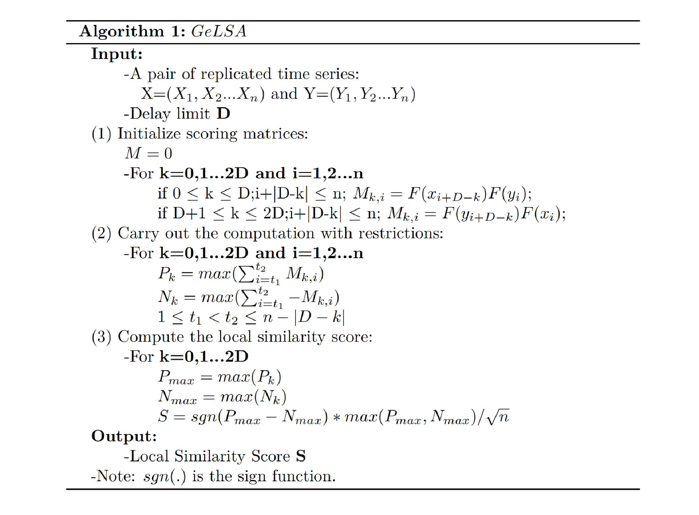
Figure 1:Algorithm Demonstration of GeLSA

The reduction is possible assuming the input time series are synced, and their effect on each other is short time framed (i.e. within a given time shift D units, D <<n). This assumption of short delay and sync is in accord with daily application scenarios [1-4]. That means when the 2-d dynamical programming algorithm aligns a pair of time series, only configurations with no gap and satisfying |Xs-Ys|<=D are possible solutions. As we observe, in this case, we can introduce 2D+1 series alignment subproblems, where the d-th subproblem is to find the optimal ungapped alignment between series pairs $(X_0…, X_i, …X_{n-d})$ and $(Y_{0+d}…, Y_{i+d}, …Y_n)$ if d ∈ {0, …, D} or $(X_{-d}…, X_{i-d}, …X_n)$ and $(Y_0…, Y_i, …Y_{n+d})$ if d ∈ {-1, …, -D}, and the best one of all 2D+1 subproblem solutions solves the original restricted 2-d alignment problem.

We then denoted the possibly truncated series pairs in the d-th subproblem as $U_i(d)$ and $V_i(d)$. Note that the pair $U_i(d)$ and $V_i(d)$ is of the same length n-d, which varies in length from n-D+1 to n. We further let $Z_i(d)$ = $U_i(d)$ * $V_i(d)$, which is the product series of corresponding $U_i$ and $V_i$ terms also of length n-d. This transformation can be done in O(n) time. Now, the original restricted optimal ungapped alignment problem of $U_i$ and $V_i$ is equivalent to finding the contiguous subarray [s, e] of $Z_i$, which gives the max sum subarray $\sum_s^e[Z_i]$. Moreover, we found out that a 1-d dynamical programming algorithm solves this subproblem in O(n) time- and O(1) space-complexity, which  is adapted into GeLSA (see Alg. 1). Since we only need to compute and store $Z_i$ temporarily during the computation, the resulting GeLSA algorithm is O(n) in time and space complexity.The mathematical proof of reduction to max sum subarray subproblems is as in the appendix of this paper.

The Gelsa computing core employs a dual-layer parallel processing architecture where the outer-layer parallelism handles parallel matching between biological data sequences while aggregating the computational results globally, and the inner-layer parallelism performs advanced alignment calculations on successfully matched sequences to determine optimal solutions for each sequence pair through comparative analysis of results. This inner-layer computational process can be further accelerated through relevant compiler optimizations or by leveraging hardware architectural advantages for parallelized computation.

The acceleration effects of this parallelization approach can be implemented differently on CPU and GPU hardware platforms. On the CPU, the outer-layer parallel processing achieves sequence matching through multi-threading, while at the inner-layer, compile-time compiler optimizations enable vectorization to accelerate sequence computations, thereby significantly improving the efficiency of pairwise sequence alignment. On the GPU, the outer parallelism is managed by streaming multiprocessors (SMs) for concurrent sequence matching, while the inner computations are executed in parallel by CUDA cores via thread-level parallelism. This design ensures efficient processing of biological sequence data across both CPU and GPU architectures.

The overall GeLSA algorithm is both powerful and designed with user-friendliness in mind. It is implemented in C++ with CUDA and packaged as a Python 3 module for easy deployment. To further simplify the process, we provide a user-friendly docker image at http://github.com/labxscut/gelsa. This image comes with comprehensive user manuals and case examples, ensuring a smooth and hassle-free experience for our users and making the installation and use of GeLSA a breeze.
 
## GeLSA’s Correctness and Efficiency

Our first and foremost priority was to validate the correctness of GeLSA. In (Fig. 2 Fig. S1 and Fig.S2), we meticulously assessed GeLSA's accuracy by comparing its results with those obtained from eLSA using the simulation data, including LS (local similarity score), P_value (p-value), Xs (alignment start position of X), Ys (alignment start position of Y), Len (aligned length), and Delay (alignment shift). Each scatter subplot in (Fig. 2 Fig. S1 and Fig.S2) demonstrates a diagonal pattern, representing the identity between corresponding variables from GeLSA and eLSA, including LS, P_value, Xs, Ys, Len, and Delay. The fitted lines all had $R^2$ values of 1, except singleton cases due to rounding errors. The near-perfect concordance in all 18 comparisons provides strong evidence that GeLSA’s results are identical to eLSA's. This level of consistency demonstrates the correctness of GeLSA as an alternative method for performing LSA, ensuring both reliability and accuracy.

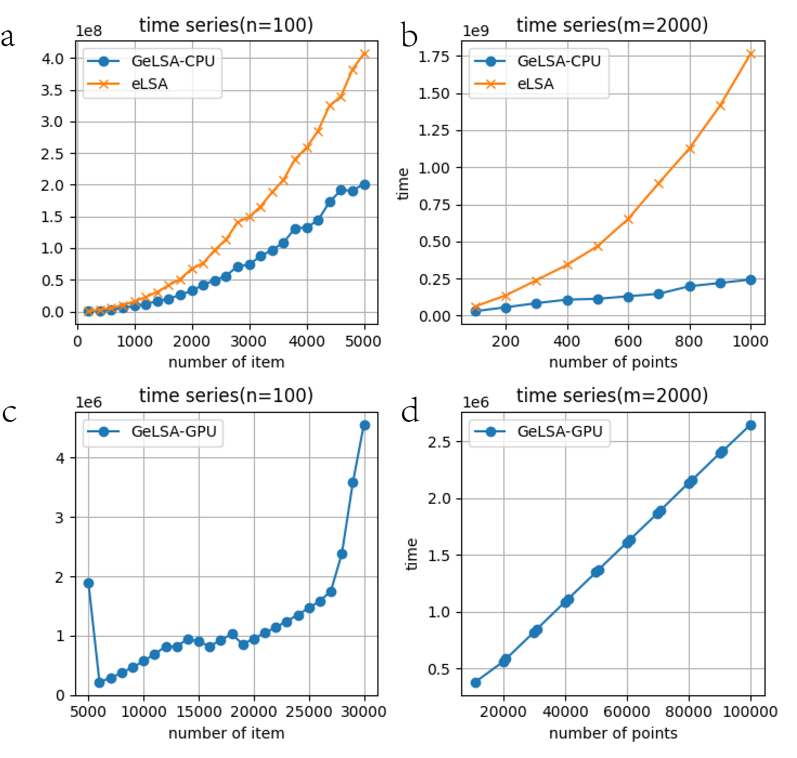
Figure 2:Comparison of Correctness in Running Results between GeLSA and eLSA
With the settings configured as follows: m=100, n=50 and d=10, this figure vividly illustrates that both the local similarity score LS (A) and other statistical measures (p_value, xs, ys, len, delay) (B, C, D, E, F) show remarkably consistent computational results between GeLSA and eLSA.

In the core-level layer, we reduce the original 2-d time series alignment problem, which requires a quadratic $O(n^2)$ time- and space-complexity dynamical programming algorithm (adapted from the Smith-Waterman local sequence alignment algorithm [10-13] and used in eLSA) to 2D+1 max sum subarray subproblems, which has an optimal 1-d dynamical programming algorithm solution in O(n) time- and space-complexity.

Based on the comparative analysis of the traditional eLSA algorithm and the improved GeLSA algorithm, we can systematically analyze their time complexity characteristics as follows: The eLSA algorithm essentially addresses a two-dimensional time series alignment problem, exhibiting a time complexity of O(n²).The GeLSA algorithm innovatively transforms this two-dimensional dynamic programming problem into (2D+1) one-dimensional dynamic programming subproblems, thereby achieving a reduced time complexity of O(n).From this algorithmic analysis, we can derive two key hypotheses regarding computational performance:
(A) Under single-core CPU conditions:
When maintaining a fixed number of time series pairs (n) while increasing the time points (m): The eLSA's execution time should follow a quadratic growth curve.Both GeLSA-CPU and GeLSA-GPU implementations should demonstrate linear time scaling.
(B) With fixed time points (n) and increasing time series pairs (m): 
All three implementations (eLSA, GeLSA-CPU, and GeLSA-GPU) are expected to exhibit quadratic time complexity growth.
We subsequently designed experiments to empirically validate these theoretical predictions.

We then assessed GeLSA’s computational efficiency and found significant improvement. We compared the running time efficiency of GeLSA’s core-level algorithm to that of eLSA on a single CPU core (Fig. 3a). With a fixed series length (n=100), GeLSA’s core algorithm consistently reduced the running time compared to eLSA across dataset sizes ranging from m=200 to m=5000, achieving an average acceleration rate of 1.94, with a variance of only 0.009086.With a fixed number of factors (m=2000) and varying series lengths (n=100 to n=1000), we can clearly observe in (Fig. 3b) that the eLSA computation time curve follows a quadratic pattern, whereas the GeLSA curve remains linear. This indicates that as the time series length increases, the advantage of the improved algorithm becomes more pronounced.

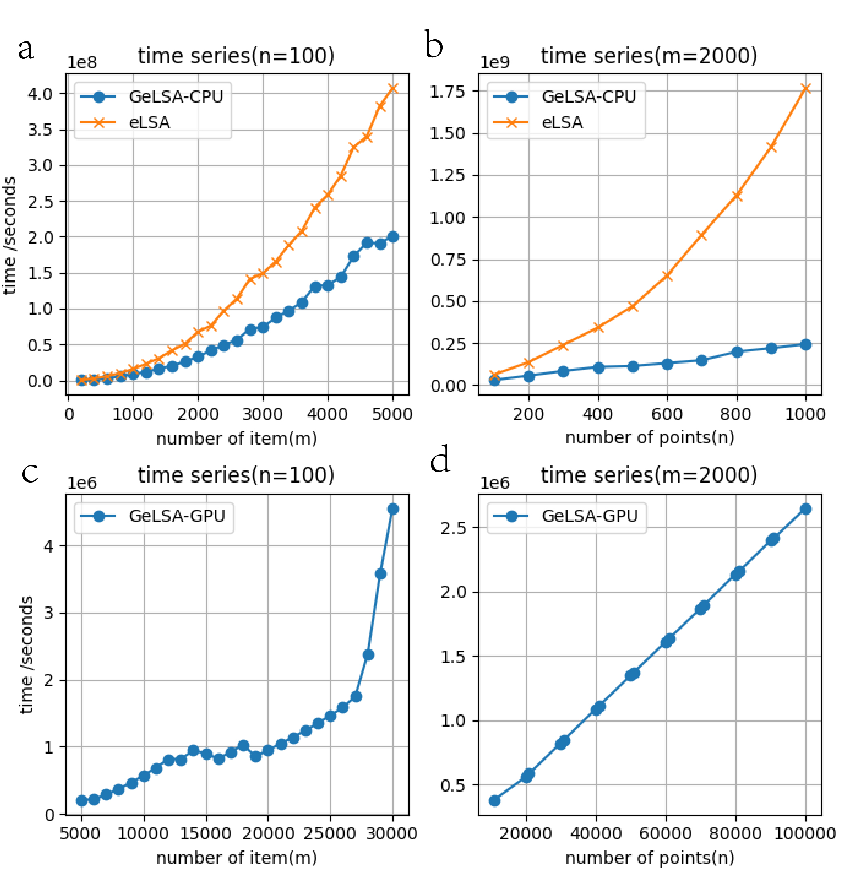
Figure 3:Comparison of Performance on Computational Cores Between GeLSA and eLSA 
A. Computational performance comparison between the novel LSA algorithm and traditional LSA on a single CPU core with fixed sequence length and increasing number of sequence pairs.
B. Computational performance comparison between traditional LSA and the GeLSA computing core on CPU with fixed number of sequence pairs and increasing sequence length.
C. Performance evaluation of GeLSA on GPU with fixed sequence length and increasing number of sequence pairs.
D. Performance evaluation of GeLSA on GPU with fixed number of sequence pairs and increasing sequence length.

When combining the core-level algorithm with outer-layer parallelization, on an Nvidia RTX 2050 GPU, we observed that the algorithm on the GPU also follows a quadratic pattern. In this context, the traditional eLSA algorithm fails to compute within the given timeframe, while GeLSA significantly improves overall efficiency. This was evident in the tests with m ranging from 5000 to 30000 and a fixed length of n=100. The average computation time did not exceed 10 seconds, while the eLSA algorithm for datasets with fewer time series could easily exceed 100 seconds (Fig. 3c).

Furthermore, for a fixed number of factors (m=2000) and varying time series lengths (n from 10000 to 100000), as shown in Fig. 3d, we can clearly see that the GeLSA-GPU curve maintains a linear trend. This highlights that as the time series length increases, the benefits of the improved algorithm become even more apparent. The computation time on the GPU consistently stayed below 10 seconds, while eLSA on datasets with 1000 time points took up to 200 seconds.

These results showed that GeLSA is 94% faster in performing a unit alignment job and significantly faster (by hundreds of times) when many jobs are orchestrated and distributively computed on a multi-core GPU. The performance gain increases with series length and is independent of dataset size, as we expected as the outcome of reduced time complexity of the overall algorithm and optimized coding. 

Adopting hardware acceleration by multi-core GPU gives the most significant speed gain. This is because the application of LSA on a dataset of n factors involves ~ n^2/2*(1(theo)+(1-1(theo))*(1/P_limit)) pairwise alignments, where the term ((1-1(theo))*(1/P_limit)) indicates the additional post-permutation alignments needed to assess p-values to the numerical precision of P_limit. Fortunately, our algorithm reduction allows those alignments to be performed independently on individual cores, involving only summation and numerical comparison operations. So, the GeLSA outer layer algorithm can parallelly use the tens to hundreds of cores available on a modern CPU or GPU, achieving hundreds of times of acceleration. 

To more clearly demonstrate the improvements in space complexity achieved by the enhanced algorithm, we fixed the number of sequence pairs while increasing the sequence length to observe the changes in memory usage between GeLSA and eLSA. For this purpose, we used a dataset with m (number of sequence pairs) = 2000 and n (sequence length) = [1000, 2000, 3000, ..., 10000] to monitor the resident memory usage of GeLSA (computed using a single CPU core), GeLSA (computed using GPU), and eLSA under the same dataset. The results were then plotted for comparison (Fig. 3_1).

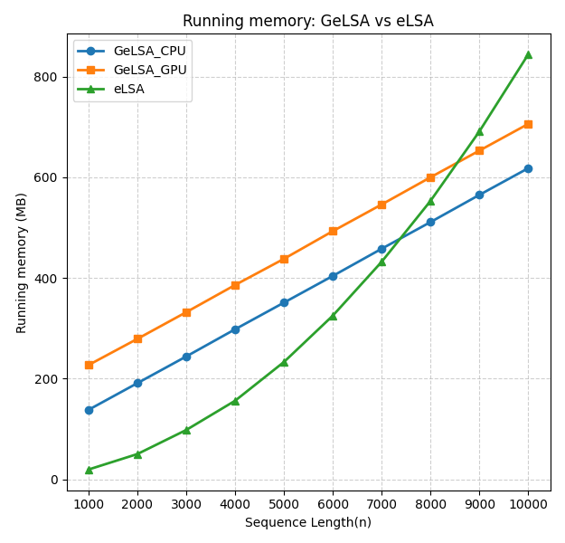
Figure 3_1:Comparison of Memory Usage Between GeLSA and eLSA Computational Cores

In Figure 3_1, we observe that the resident memory usage of both GeLSA-CPU and GeLSA-GPU in the computer system maintains a perfectly linear trend as the sequence length increases, while eLSA's memory consumption curve exhibits an accelerating slope with growing sequence lengths, providing direct empirical evidence that GeLSA achieves O(n) space complexity compared to eLSA's O(n²) spatial requirements. Notably, during the initial phase of the curves, GeLSA demonstrates higher memory occupancy than eLSA, which stems from its architectural design considerations: the CPU implementation intentionally employs multithreading technology to fully utilize multiple processor cores, inevitably introducing additional memory overhead from intra-process data copying operations, and the GPU version further compounds this effect through necessary data transfers between host memory and device VRAM during computation. These deliberate engineering tradeoffs, while temporarily increasing memory pressure for smaller datasets, ultimately enable GeLSA's superior scalability as evidenced by its stable linear memory growth pattern contrasting with eLSA's quadratic explosion.

In summary, from both theoretical analysis and experimental evidence, we can conclude that the improved GeLSA algorithm is highly effective. The benefits of the improved algorithm become more pronounced as the time series length increases. Additionally, the computational acceleration on GPUs is highly efficient, leading to significant performance improvements on personal computers equipped with multi-core CPUs and GPUs.

### GeLSA Acceleration’s Scalability and Generalizability

We assessed the acceleration by GeLSA on eLSA and many other LSA and LTA algorithms with both theory and permutation p-value approaches (see Methods) and demonstrated the scalability and generalizability of GeLSA acceleration. The findings for theory p-value LSA and LTA algorithms on a factor-varying (n=100, m={100, 300, 500, 1000, 1500, 2000, 3000, 4000, 5000, 6000, 7000, 8000, 9000, 10000}) and a length-varying (m=1000, n={20, 40, 60, 80, 100}) dataset are shown in Figs. 4a to 4b, and Figs. 4c to 4d, respectively. Note that theoretical p-value based approaches are fast tail probability approximations based on the asymptotic theory of random walk excursion range. It allows precomputation and constant time evaluation of p-value at program runtime but requires the input series to be at least 20 units long (n>=20) for validity. It enables LSA to analyse thousands of factors on a PC, significantly more than permutation.

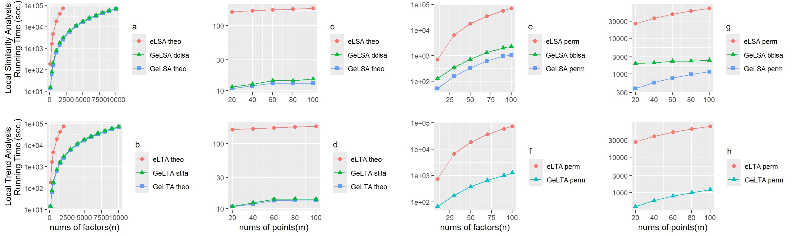
Figure 4:Overall Software Performance Comparison between GeLSA and eLSA
There are a total of 8 subgraphs in Figure 4, and the line graph data in each subplot are obtained by averaging the results of 5 experimental tests. 

In the factor-varying benchmark, GeLSA_theo significantly accelerated eLSA_theo in all settings, particularly gaining momentum as the number of factors increased (Fig. 4a). At 100 factors, GeLSA_theo is 14.09 times faster, at 500 and 1,000 factors, it is 27.84 times faster, and at 2,000 factors it is 28.88 times faster than eLSA_theo. These substantial acceleration rates highlight the efficiency of GeLSA_theo compared to eLSA_theo. The same trend is observed for GeLSA_DDLSA: at m=100 factors, it is 12.12 times while at m=2,000 factors 23.77 times faster than eLSA_theo. There is no noticeable difference in efficiency between the GeLSA_theo and GeLSA_DDLSA, even though DDLSA uses a modified p-value theory compared to eLSA. This verifies GeLSA acceleration’s generalizability. Our experiments, which were limited to $10^5$ seconds, showcased the remarkable efficiency of GeLSA_theo and GeLTA_theo. In contrast, eLSA_theo, despite its capabilities, could not complete parts of the datasets for m>2500. This underscores the superior performance of the GeLSA accelerated algorithms, which could finish within the time constraints.

Similarly, when applied to local trend analysis, GeLTA_theo significantly accelerated eLTA_theo, particularly as the number of factors increases (Fig. 4b). The trend is also observed with GeLTA_STLTA. There is also no noticeable difference in running time between the GeLTA_theo and GeLTA_STLTA, despite STLTA’s use of a different p-value theory, proving the GeLSA acceleration is agonistic to p-value computation. The experiments were also cut off at $10^5$ seconds, resulting in eLTA_theo not finishing parts of datasets (m>2500), highlighting the importance of the GeLTA acceleration given time-sensitive large-scale analysis tasks.

In the timepoint-varying benchmark, GeLSA_theo also consistently outperformed eLSA_theo in all settings, with the acceleration rates increasing with the number of time points (Fig. 4c). For instance, at n=20, GeLSA_theo was 16.09 times faster than eLSA_theo, while at n=100, GeLSA_theo was 14.36 times faster. These increasing acceleration rates align with our core-level algorithm benchmark findings. The same trend was observed for GeLSA_DDLSA, which showed a similar level of acceleration over eLSA_theo across all tested time points. There was no noticeable difference in efficiency between GeLSA_theo and GeLSA_DDLSA, further verifying the GeLSA acceleration’s generalizability. Similarly, when applied to local trend analysis, GeLTA_theo and GeLTA_STLTA were significantly accelerated compared to eLTA_theo, notably as time points increased (Fig. 4d). 

The running time results of permutation-based LSA and LTA analyses on factor-varying (n=100, m={10, 30, 50, 70, 90, 100}) and a series length varying (m=100, n={20, 40, 60, 80, 100}) datasets are shown in (Fig. 4e Fig. 4g), and (Fig. 4f Fig. 4h), respectively. Permutation is a slower p-value approximation approach that requires additional shuffling of the original series and realigning the permuted series. The p-value evaluation time cost is the inverse of the required precision, significantly higher than theoretical approaches, although it can be validly applied to any length series. Therefore, we reduced the max m to 100 to ensure most comparison jobs were finished in the cut-off time.

In the factor-varying benchmark, GeLSA_perm significantly accelerated eLSA_perm and GeLSA_BBLSA in all settings, where the efficiency difference increases as the number of factors increases (Fig. 4e). E.g. at m=10, GeLSA_perm is 13.89 times faster while at m=100 factors, it is 66.85 times faster than eLSA_perm, while at m=10, GeLSA_BBLSA is 5.61 times faster while at m=100 factors, it is 30.82 times faster than eLSA_perm. These substantial rates highlighted GeLSA’s great acceleration of both eLSA_perm and BBLSA algorithms. Note that GeLSA_perm is noticeably consistently faster than GeLSA_BBLSA, maybe because of more complex block-based shuffling involved in BBLSA. However, the acceleration effect on GeLSA_BBLSA and GeLSA_perm is of little difference, thus proving GeLSA's universal acceleration ability. Similarly, GeLTA_perm significantly accelerated eLTA_perm in all settings, where the efficiency difference increases as the number of factors increases (Fig. 4f).

In the timepoint-varying benchmark, GeLSA_perm and GeLSA_BBLSA also significantly accelerated eLSA_perm in all settings, and the acceleration rates increased with the number of timepoints (Fig. 4g). E.g. at n=20, GeLSA_perm is 65 times faster than eLSA_perm while at n=100, GeLSA_perm is 60.8 times faster. The same trend is true for GeLSA_BBLSA, as it showed a similar level of acceleration over eLSA_perm across all tested time points. Similarly, GeLTA_theo was significantly accelerated compared to eLTA_theo, particularly as time points increased (Fig. 4h). 

These experiments together demonstrated GeLSA’s strong generalizability and scalability to accelerate local similarity analysis-based algorithms, making it a new, versatile, and fast tool for analysing large-scale multi-omics time series generated from biological systems. We will exemplify this with the following case study. 

### The Daya Bay microbiome dynamics

We applied LSA using GeLSA to the 72-hour time series data from Daya Bay. We identified many potential microbial interactions between viruses, phytoplankton and prokaryotes (see Fig. 5). These interactions include symbiosis, cross-nutrition, competition, parasitism, predation, and allelopathy. It was found that several significant time-lagged correlations (Spearman's |R| > 0.70, P < 0.01) exist between major phytoplankton taxa and specific prokaryotes in the Daya Bay time series. Significant correlations were observed between certain diatoms and members of the Alphaproteobacteria, Gammaproteobacteria and Bacteroidota.

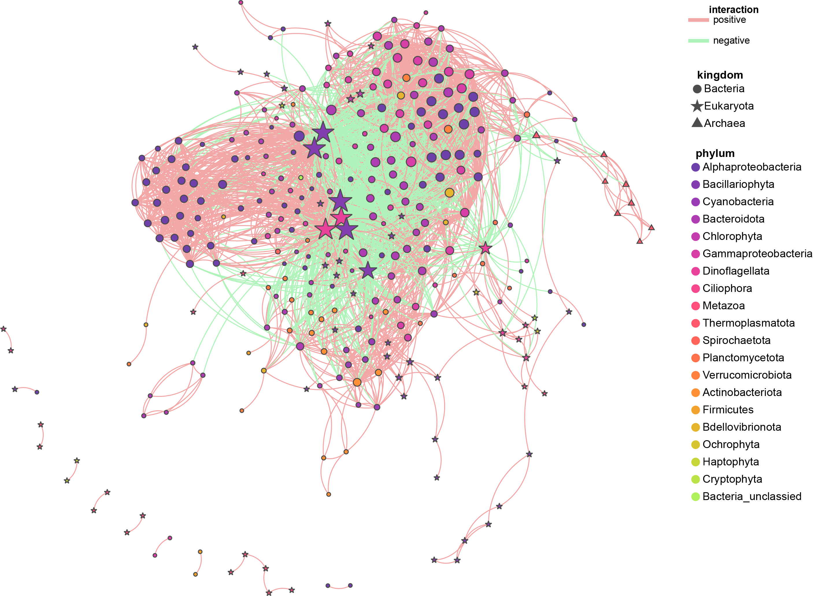
Figure 5:Network Visualization of GeLSA Computation Results on the Daya Bay Dataset

Furthermore, time-lagged correlations were also observed between dominant MGII (Marine Group II) archaea and diatoms such as Chaetoceros (Bacillariophyta) and Gyrodinium (Dinophyta). These findings provide insights into the interactions between traditional phytoplankton and prokaryotes, offering a higher phylogenetic and temporal resolution. 

Fig. 5 illustrates the microbial association network in the 72-hour time series of Daya Bay, showing that the local similarity correlations with time-lags associated with major phytoplankton taxa often involve bacteria and archaea, indicating temporal delays.

## Conclusions

We developed GeLSA (GPU-accelerated extended Local Similarity Analysis), a novel multi-core accelerated computing tool for large-scale time series local similarity analysis. GeLSA newly adapted the max sum subarray dynamical programming algorithm for LSA, allowing efficient core-level parallelisation to leverage modern CPU/GPU architectures. GeLSA improved computational efficiency by approximately 144-fold over eLSA on a GPU machine. In particular, for permutation-based LSA, a workload would take a month on eLSA and can be completed in one day by GeLSA on a GPU-powered PC.

Because it optimises the underlying alignment process, GeLSA accelerates the original LSA and theoretical and permutation p-value-based LSA improvements, including the local trend analysis, permutation-based MBBLSA, and theory-based DDLSA and STLTA methods. In the benchmarks, GeLSA maintained the accuracy of those methods while substantially improving their efficiency. As an application, we applied GeLSA to a 72-hour hourly microbiome series tracking nearly thousands of marine microbes. We analysed the resulting co-occurrence networks of phytoplankton, bacteria, and viruses in Shenzhen’s Daya Bay. We have also made GeLSA freely available to academics. 

## Authors’ contributions 

YL revamped the LSA algorithm and applied it for parallel computation on both CPU and GPU, further parallelising the software by circumventing Python's GIL. YL participated in software performance and correctness comparisons and contributed to drafting the manuscript. SSX analysed the network graph of the Daya Bay dataset computation results and translated this analysis into text. SWH, YHX, and LX conceived the research, participated in its design and coordination, and assisted in drafting the manuscript. All authors read and approved the final manuscript.

## Competing interests
The authors have declared no competing interests.

## Acknowledgements
This study was funded by the the Guangdong Basic and Applied Basic Research Foundation(2022A1515-010699) to LCX.

## References

[1] Caporaso JG, Lauber CL, Costello EK, et al. Moving pictures of the human microbiome. Genome Biol 2011;12:R50. 

[2] Cram JA, Xia LC, Needham DM, et al. Cross-depth analysis of marine bacterial networks suggests downward propagation of temporal changes. ISME J 2015;9:2573–86. 

[3] Steele JA, Countway PD, Xia L, et al. Marine bacterial, archaeal and protistan association networks reveal ecological linkages. ISME J 2011;5:1414–25. 

[4] Shade A, McManus PS, Handelsman J. Unexpected diversity during community succession in the apple flower microbiome. MBio 2013;4:e00602–12. 

[5] Cho RJ, Campbell MJ, Winzeler EA, et al. A genome-wide transcriptional analysis of the mitotic cell cycle. Mol Cell 1998;2: 65–73. 

[6] Spellman PT, Sherlock G, Zhang MQ, et al. Comprehensive identification of cell cycle-regulated genes of the yeast Saccharomyces cerevisiae by microarray hybridization. Mol Biol Cell 
1998;9:3273–97. 

[7] Amar D, Yekutieli D, Maron-Katz A, et al. A hierarchical Bayesian model for flexible module discovery in three-way time-series data. Bioinformatics 2015;31:i17–26. 

[8] Vaisvaser S, Lin T, Admon R, et al. Neural traces of stress: cortisol related sustained enhancement of amygdala-hippocampal functional connectivity. Front Hum Neurosci 2013;7:313. 

[9] Durno WE, Hanson NW, Konwar KM, Hallam SJ. Expanding the boundaries of local similarity analysis. BMC Genomics 2013;14(Suppl 1):S3. 

[10] Qian J, Dolled-Filhart M, Lin J, et al. Beyond synexpression relationships: local clustering of time-shifted and inverted gene expression profiles identifies new. Biologically relevant interactions. J Mol Biol 2001;314:1053–66.

[11] Xia LC, Ai D, Cram J, et al. Efficient statistical significance approximation for local similarity analysis of high-throughput time series data. Bioinformatics 2013;29:230–7. 

[12] Xia LC, Steele JA, Cram JA, et al. Extended local similarity analysis (eLSA) of microbial community and other time series data with replicates. BMC Syst Biol 2011;5:S15. 

[13] Ruan Q, Dutta D, Schwalbach MS, et al. Local similarity analysis reveals unique associations among marine bacterioplankton species and environmental factors. Bioinformatics 2006;22: 2532–8.

[14] He F, Zeng AP. In search of functional association from timeseries microarray data based on the change trend and level of gene expression. BMC Bioinformatics 2006;7:69. 

[15] Ji L, Tan KL. Identifying time-lagged gene clusters using gene expression data. Bioinformatics 2005;21:509–16. 

[16] Xia LC, Ai D,Cram JA, et al. Statistical significance approximation in local trend analysis of high-throughput time-series data using the theory of Markov chains. BMC Bioinformatics 2015;16:301. 

[17] Zhang F, Shan A, Luan Y. A novel method to accurately calculate statistical significance of local similarity analysis for high-throughput time series. Stat Appl Genet Mol Biol 2018; 17:20180019. 

[18] Zhang F, Sun F, Luan Y. Statistical significance approximation for local similarity analysis of dependent time series data. BMC Bioinformatics 2019;20:53. 

[19] Shan A, Zhang F, Luan Y. Efficient approximation of statistical significance in local trend analysis of dependent time series. Front Genet 2022;13:729011

[20] Chen S, Arifeen MZU, Li M,Xu S, Wang H, Chen S, Tao J, Guo K,Yan R, Zheng Y, et al. Diel Patternsin the Composition and Activity ofPlanktonic Microbes in a SubtropicalBay. Ocean-Land-Atmos. Res.2024;3:Article 0044.

## Supplementary material

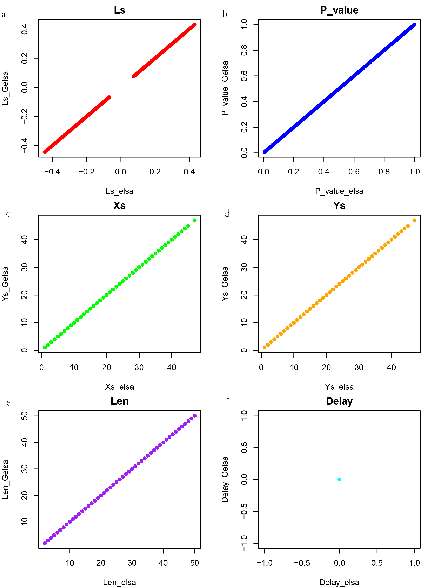
Figure S1:Comparison of Correctness in Running Results between GeLSA and eLSA
This figure vividly illustrates that both the local similarity score LS (A) and other statistical measures (p_value, xs, ys, len, delay) (B, C, D, E, F) show remarkably consistent computational results between GeLSA and eLSA, with delay = 0.

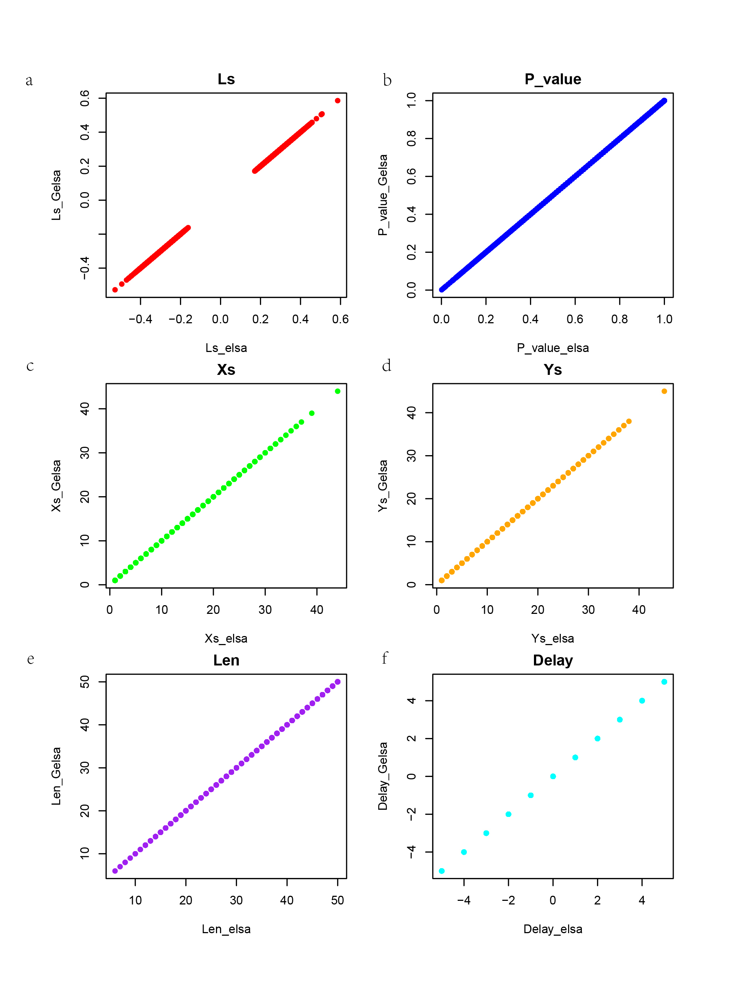
Figure S2:Comparison of Correctness in Running Results between GeLSA and eLSA
This figure vividly illustrates that both the local similarity score LS (A) and other statistical measures (p_value, xs, ys, len, delay) (B, C, D, E, F) show remarkably consistent computational results between GeLSA and eLSA, with delay = 5.

### Proof of GeLSA Theory
- [Proof of GeLSA Theory](./proof/paper/The_Proof_of_GeLSA_Theory.pdf)
- Review:
  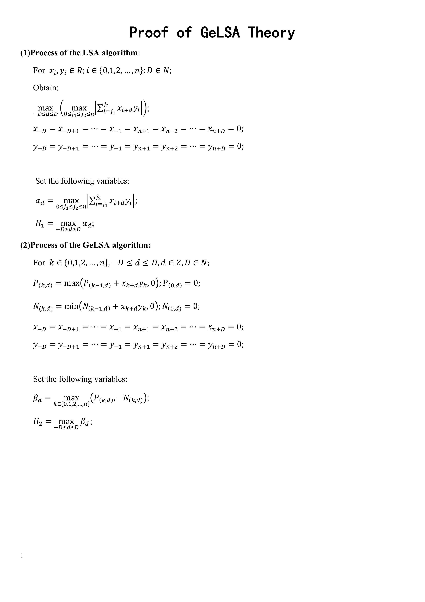
  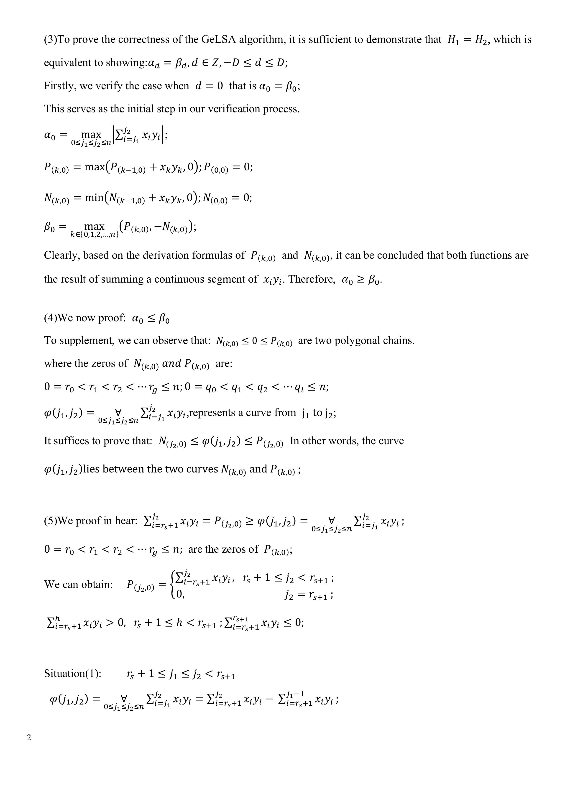
  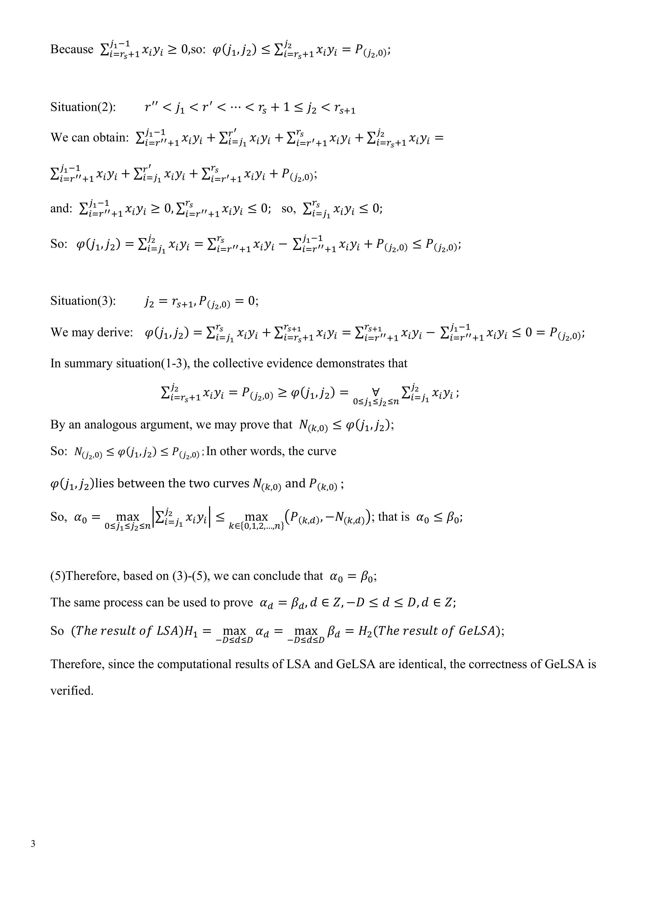
  