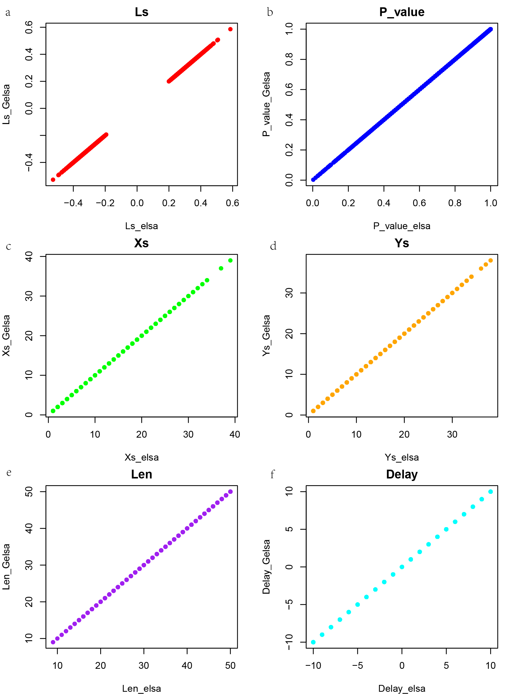
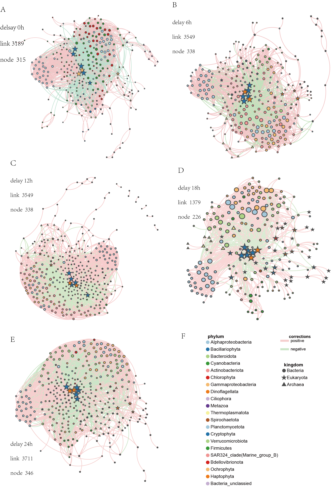
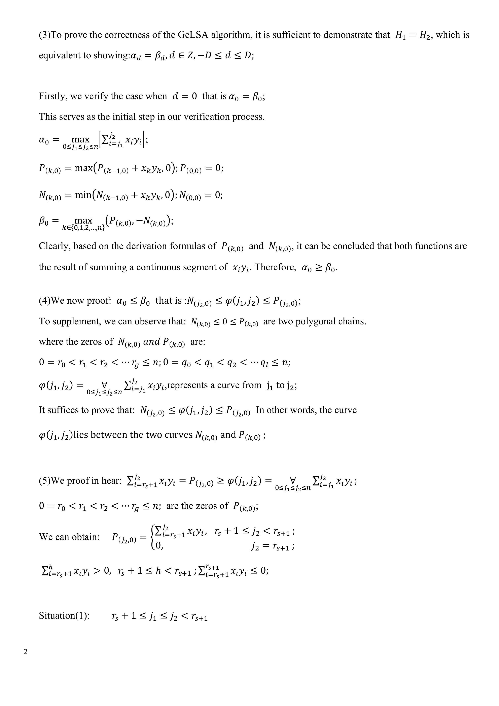
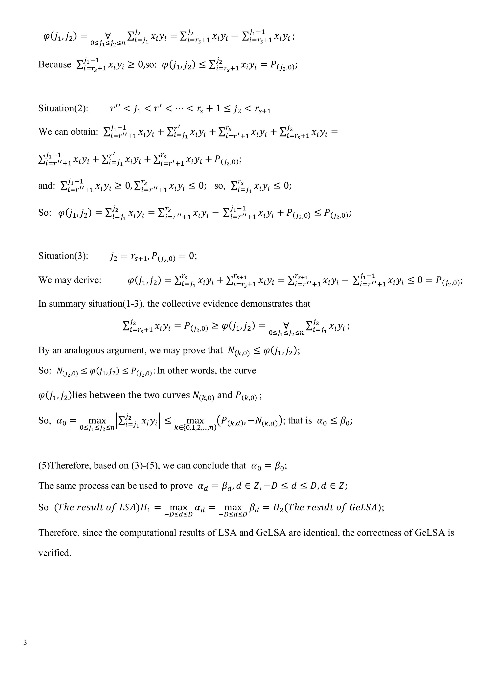

# GeLSA: a GPU-accelerated Local Similarity Analysis Software for Time-Series Data Analysis

Yang Li1, Shuaishuai Xu2, Hongyu Duan1, Yuqian Mo2, Yunhui Xiong1, Dongmei Ai3, Shengwei Hou2, Li Charlie Xia1,*

1Department of Statistics and Financial Mathematics, School of Mathematics, South China University of Technology, Guangzhou 510641, China  
2Department of Ocean Science & Engineering, Southern University of Science and Technology, Shenzhen 518055, China  
3Department X, Y, Shenzhen 518055, China  

*Corresponding author(s).  
E-mail: lcxia@scut.edu.cn (Li C. Xia).

## Abstract

Time-series data in biological and environmental sciences are crucial for uncovering temporal patterns and dynamic interactions within complex systems. By identifying local alignment configurations between time series, the Local Similarity Analysis (LSA) algorithm could provide insights into dynamic and delayed interactions. However, with the rapid accumulation of multi-omics datasets, a more scalable and efficient implementation of LSA is required. Here, we introduce GeLSA (GPU-accelerated extended Local Similarity Analysis), a novel multi-core GPU accelerated software enables rapid LSA computation for large-scale time series data. GeLSA adapted the max sum subarray dynamical programming algorithm for LSA, allowing efficient core-level parallelization to use modern CPU/GPU architectures. Compared to the previous most efficient LSA implementation (eLSA), GeLSA achieved over a 100-fold increase in speed on GPU-equipped machines. Furthermore, GeLSA accelerates various LSA-derived algorithms, including the local trend analysis (LTA), permutation-based MBBLSA, theory-based DDLSA, and STLTA methods. Benchmarking results demonstrate substantial improvements in computational efficiency while maintaining their accuracy. As a case study, by analyzing high-resolution microbial time-series data from Daya Bay, GeLSA revealed significant time-lagged correlations between phytoplankton and bacteria/archaea, demonstrating its efficiency and ecological value in deciphering complex microbial interaction networks. GeLSA is a versatile and high-performance tool for large-scale time series analysis, and it is freely available for academic use at http://github.com/labxscut/gelsa. 

**KEYWORDS:** Local similarity analysis; GPU acceleration; Time series; Microbiome; Multi-core parallelisation

## Introduction

Understanding the interactions and impacts among factors within ecological or biological systems is fundamental to advancing research in biological and environmental sciences. Time series data, which capture sequential measurements over time, provide an effective way to study interactions in complex systems. Traditionally, global correlation methods, such as Pearson or Spearman correlation, have been employed to detect pairwise relationships across the entire time interval. However, real-world biological or environmental data often exhibit complex, dynamic relationships, including local and time-delayed correlations that can’t be captured by global methods. These nuanced interactions are prevalent in various fields such as microbiology [1-4], molecular biology [5,6], and neuroscience [7,8]. 

To address the limitations of global correlation approaches, local similarity analysis (LSA) has been introduced to identify local alignment configurations between time series, enabling the detection of local and potentially delayed correlations [10-13].  The LSA method was initially proposed by Qian et al. for gene expression analysis [10], and was later adapted for various applications including molecular fingerprint data analysis by Ruan et al. [13] and metagenomics data analysis by Xia et al. [12]. Due to its intuitive interpretability and effectiveness, LSA has become widely adopted in many areas and has received significant theoretical and practical advancements.  

Key methodological improvements to LSA include eLSA, a fast C++ implementation that extended LSA to handle data with replicates[12]. Later, statistical theories for LSA p-value approximation [9,11] were integrated into eLSA. More recent advancements, such as Moving Block Bootstrap LSA (MBBLSA) [17] and Data-Driven LSA (DDLSA) [18], have been developed to include dependent background null models. Similarly, local trend analysis (LTA) [14-16], which identifies local patterns in direction-of-change series, and Xia et al.'s theoretical approximation of its statistical significance [16], as well as Shan et al.’s Steady-state Theory Local Trend Analysis (STLTA) for dependent null background [19], remain to be implemented in eLSA.

The rapid expansion of sequencing-based multi-omics time series data has created  an urgent demand for more efficient and scalable LSA tools. While eLSA remains the most efficient LSA implementation, its computational limits are increasingly challenged by the growing scale and complexity of modern datasets. For instance, eLSA allows pairwise analysis of hundreds to thousands of factors within a day, depending on series length and the use of theoretical or permutation-based p-value approximations.

To address these challenges, we developed GeLSA, a GPU-accelerated tool designed to enhance the efficiency of local similarity analysis for large-scale time series data. GeLSA leverages the fast-growing multi-core capacity of modern CPUs and GPUs (Rahman & Sakr, 2021; Palleja et al., 2020; Beyer et al., 2021) to optimize the computation process and reduce the time complexity of computations. By adapting the max sum subarray algorithm to LSA and take advantage of multi-core architectures, GeLSA significantly improves the analysis efficiency, achieving over a 100-fold acceleration on Nvidia (RTX2050) compared to eLSA. Specifically, GeLSA can now analyze data series ranging from approximately 1,000 to 10,000 data points daily, depending on the length of the series on GPU-equipped computers, significantly expanding the analytical capacity for real-world tasks. Moreover, GeLSA integrates and accelerates an expanded set of LSA-derived algorithms, including MBBLSA, DDLSA, and STLTA [17-19], thus enabling more efficient time series analysis under autocorrelated and Markovian backgrounds. Overall, it provides researchers with a powerful tool to uncover dynamic interactions in complex biological and environmental systems.

## Materials and methods

### Simulation Data

To assess the accuracy and computational efficiency of GeLSA software under controlled conditions, two distinct sets of simulated data were generated for comparative analysis against the eLSA tool. In the first dataset, termed simFixLen[n, t], the length of each time series was fixed at n=100. A total of m=[20, 40, 60, 80, 100] pairs of independent and identically distributed (i.i.d.) standard normal valued were randomly sampled, with all series maintaining the fixed length of n. In the second dataset, called simFixSize[m, t], the number of sequence pairs was fixed at m=200 and randomly sampled pairs of i.i.d. standard normal values for varying series length n=[100, 300, 500, 1000, 1500, 2000, 3000, 4000, 5000, 6000, 7000, 8000, 9000, 10000]. These simulated datasets were employed to benchmark the accuracy and computational performance of GeLSA relative to eLSA, ensuring consistency in input parameters and experimental conditions.

### Benchmark Workflow and Evaluation Measures

The eLSA tool has already been extensively benchmarked [12] and widely used in real-world data analysis with demonstrated high accuracy and efficiency [11]. To objectively evaluate the performance of GeLSA relative to eLSA, a series of benchmarking experiments were conducted under identical input data, parameter settings, and hardware conditions.

Because the performance improvement is expected both from adapting the max sum subarray dynamical programming algorithm and employing multi-cores, under the above criteria, we first assessed the algorithms’ running time (in microseconds) and the acceleration of GeLSA over eLSA using just one CPU core, using the simulated data with a fixed series length of n=50 and varying numbers of sequence pairs m=[500, 2000, …, 10000] (Fig. 3a). Subsequently, larger scales datasets with the identical sequence lengths but m=[5000, 6000, …, 30000] were then assessed, allowing GeLSA to use a RTX2050 (Fig. 3c). 

To examine the computational efficiency improvement of the newly designed algorithm as the sequence length increases while keeping the number of sequence pairs fixed, the running time and acceleration of GeLSA over eLSA were measured  using the simulated datasets withm =100 and varying series lengths n=[100, 200, …, 1000] on a single CPU core (Fig. 3b). For larger datasets with m=100 and n=[1000, 2000, …, 10000], the performance was evaluated using an NVIDIA RTX2050 GPU (Fig. 3d).

To validate the optimization effects of the improved algorithm on space complexity, we fixed the number of sequence pairs (m=2000) while progressively increasing the sequence length (n=[1000, 2000, 3000,...,10000]). By monitoring and comparing the resident memory usage changes of GeLSA (single CPU core and GPU computation on RTX2050) and eLSA under identical conditions (see Fig. 4).

### Benchmark Acceleration of Improvement Algorithms 

To evaluate the acceleration effects of GeLSA on previous LSA improvement algorithms, , a series of experiments were conducted. P-value evaluation was considered the bottleneck of LSA, which has been the focus of  numerous theory- and permutation-based p-value estimation improvements in prior research[14-16]. By leveraging hardware acceleration, GeLSA optimizes the underlying alignment algorithm, enabling the acceleration of these improvements across various methods. 

Following the methodologies outlined in prior publications, we implemented those LSA improvements (e.g. BBLSA, DDLSA) in GeLSA. Using simulated datasets, we systematically evaluated and compared the computational efficiency of various LSA improvement algorithms (including BBLSA, DDLSA, etc.) implemented within the GeLSA framework (Fig. 5a-g).  Comparisons were conducted among eLSA using permutation (eLSA_perm) or theoretical (eLSA_theo) p-values, GeLSA using permutation (GeLSA_perm) or theoretical (GeLSA_theo) p-values, GeLSA using the BBLSA (GeLSA_BBLSA) permutation or the DDLSA (GeLSA_BBLSA) theory.

We also implemented and compared GeLSA’s acceleration of LTA improvement algorithms (e.g., STLTA [19]). The comparisons were among eLTA (LTA by eLSA) using permutation (eLTA_perm) or theoretical (eLTA_theo) p-values, GeLSA using permutation (GeLTA_perm) or theoretical (GeLTA_theo) p-values, and GeLSA using the STLTA (GeLTA_STLTA) theory. Please refer to their corresponding references for details of these p-value estimation improvements.

## Results and Discussion

### GeLSA: A Redesigned LSA Algorithm

The primary contribution of this study is the developement of GeLSA, a novel multi-core algorithm and software designed to accelerate LSA for large-scale time series data analysis. (see Alg. 1 and Fig. 1 ). GeLSA introduces two layers of computational acceleration over traditional eLSA algorithm. GeLSA has introduced significant optimizations to the core algorithm for the original time series alignment problem. The original problem employs a two-dimensional dynamic programming approach based on the Smith-Waterman local sequence alignment algorithm [10-13] (which is also the method used by eLSA), resulting in time and space complexity of O(n²). Through algorithmic innovation, GeLSA transforms this problem into 2D+1 maximum subarray subproblems, which can be solved using an optimal one-dimensional dynamic programming algorithm with time and space complexity of O(n).

Figure 1:Algorithm Demonstration of GeLSA

The reduction assumes the input time series are synced, and their effect on each other is localized (i.e. within a given time shift D units, D <<n). This assumption of short delay and sync is in accord with daily application scenarios [1-4]. The algorithm reformulates the restricted 2D alignment problem into 2D+1 subproblems, where each subproblem identifies the optimal ungapped alignment between truncated series pairs. Specifically, the d-th subproblem is to find the optimal ungapped alignment between series pairs $(X_0…, X_i, …X_{n-d})$ and $(Y_{0+d}…, Y_{i+d}, …Y_n)$ if d ∈ {0, …, D} or $(X_{-d}…, X_{i-d}, …X_n)$ and $(Y_0…, Y_i, …Y_{n+d})$ if d ∈ {-1, …, -D}, and the best one of all 2D+1 subproblem solutions solves the original restricted 2-d alignment problem.

Let’s denoted the truncated series pairs in the d-th subproblem as $U_i(d)$ and $V_i(d)$ of the same length n-d with length ranging from n-D+1 to n, and denote $Z_i(d)$ = $U_i(d)$ * $V_i(d)$, the product series of corresponding $U_i$ and $V_i$ terms. Now, the original restricted optimal ungapped alignment problem of $U_i$ and $V_i$ is equivalent to finding the contiguous subarray [s, e] of $Z_i$, which gives the maximum sum subarray $\sum_s^e[Z_i]$. This transformation can be done in O(n) time- and O(1) space-complexity using a 1-d dynamical programming algorithm as implemented in  GeLSA (Alg. 1). Since we only need to compute and store $Z_i(d)$ temporarily during the computation, the resulting GeLSA algorithm is O(n) in time and space complexity. The mathematical proof of reduction to max sum subarray subproblems is provided in the appendix of this paper.

We then denoted the possibly truncated series pairs in the d-th subproblem as $U_i(d)$ and $V_i(d)$. Note that the pair $U_i(d)$ and $V_i(d)$ is of the same length n-d, which varies in length from n-D+1 to n. We further let $Z_i(d)$ = $U_i(d)$ * $V_i(d)$, which is the product series of corresponding $U_i$ and $V_i$ terms also of length n-d. This transformation can be done in O(n) time. Now, the original restricted optimal ungapped alignment problem of $U_i$ and $V_i$ is equivalent to finding the contiguous subarray [s, e] of $Z_i$, which gives the max sum subarray $\sum_s^e[Z_i]$. Moreover, we found out that a 1-d dynamical programming algorithm solves this subproblem in O(n) time- and O(1) space-complexity, which  is adapted into GeLSA (see Alg. 1). Since we only need to compute and store $Z_i$ temporarily during the computation, the resulting GeLSA algorithm is O(n) in time and space complexity.The mathematical proof of reduction to max sum subarray subproblems is as in the appendix of this paper.

The GeLSA computing core employs a dual-layer parallel processing architecture to further enhance computational efficiency. The outer-layer parallelism handles parallel sequence matching across biological data and aggregates the computational results globally, while the inner-layer parallelism performs alignment calculations on successfully matched sequences and determines optimal solutions for each sequence pair by conducting comparative analysis on all (2D+1) computational results. The acceleration effects of this parallelization approach can be implemented differently on CPU and GPU hardware platforms. On the CPU platform, the outer-layer parallel processing achieves sequence matching through multi-threading, while the inner-layer computations are accelerated through SIMD-optimized compiler directives with vectorization enabled, thereby significantly improving the efficiency of pairwise sequence alignment. On the GPU platform, the outer-layer parallelism is managed by streaming multiprocessors (SMs) for concurrent sequence matching, while the inner-layer computations are executed in parallel by CUDA cores via thread-level parallelism. This design ensures efficient processing of biological sequence data across both CPU and GPU architectures.The overall GeLSA algorithm is implemented in C++ with CUDA and packaged as a Python 3 module for easy deployment and ease of use. Additionally, a user-friendly Docker image is provided at http://github.com/labxscut/gelsa, along with comprehensive user manuals and case examples. This ensures seamless deployment and accessibility for researchers,  enabling efficient analysis of large-scale time series datasets. 
 
### GeLSA’s Correctness and Efficiency

The correctness and computational efficiency of GeLSA were rigorously validated through comparative analyses against the traditional eLSA algorithm. As shown in Fig. 2 Fig. S1 and Fig.S2, the accuracy of GeLSA was compared with those obtained from eLSA using simulation datasets. Key metrics, including LS (local similarity score), P_value (p-value), Xs (alignment start position of X), Ys (alignment start position of Y), Len (aligned length), and Delay (alignment shift), were assessed. Scatter plots of these metrics revealed near-perfect concordance between GeLSA and eLSA (Fig. 2 Fig. S1 and Fig.S2), with fitted lines exhibiting R² values of 1, except for singleton cases due to rounding errors. The near-perfect concordance in all 18 comparisons provides strong evidence that GeLSA’s results are identical to eLSA's. This consistency across all comparisons strongly supports the correctness of GeLSA as an alternative method for performing LSA, ensuring both reliability and accuracy.

Figure 2:Comparison of Correctness in Running Results between GeLSA and eLSA
With the settings configured as follows: m=100, n=50 and d=10, this figure vividly illustrates that both the local similarity score LS (A) and other statistical measures (p_value, xs, ys, len, delay) (B, C, D, E, F) show remarkably consistent computational results between GeLSA and eLSA.

In the core-level layer, GeLSA achieves significant computational efficiency improvements by reducing the original 2-d time series alignment problem, which requires a quadratic O(n2) time- and space-complexity (adapted from the Smith-Waterman local sequence alignment algorithm [10-13] and used in eLSA) to 2D+1 1-d max sum subarray subproblems with optimal time- and space-complexity of O(n). This reduction is achieved by leveraging the assumption that input time series are synchronized and their interactions occur within a short time frame, a condition commonly met in real-world applications.

The comparative analysis of computational performance between eLSA and GeLSA revealed substantial efficiency gains:(A) Under single-core CPU condition, when maintaining a fixed number of time series pairs (m) while increasing the time points (n), the eLSA's execution time should follow a quadratic growth curve. Both GeLSA-CPU and GeLSA-GPU implementations should demonstrate linear time scaling. (B) With fixed time points (m) and increasing time series pairs (m): All three implementations (eLSA, GeLSA-CPU, and GeLSA-GPU) are expected to exhibit quadratic time complexity growth. We subsequently designed experiments to empirically validate these theoretical predictions.

The GeLSA algorithm demonstrates significant computational efficiency advantages over eLSA. In single-core CPU tests (Fig. 3a) with a fixed time series length (n=100), GeLSA's core algorithm achieved consistent acceleration across dataset sizes ranging from m=200 to 5000, delivering an average speedup ratio of 1.94 with remarkably low variance (0.009086), indicating stable performance enhancement. Notably, when maintaining a fixed number of factors (m=2000) while increasing time series length from n=100 to 1000 (Fig. 3b), eLSA exhibited quadratic time complexity growth, whereas GeLSA maintained linear scaling - a characteristic that makes the algorithmic improvements increasingly beneficial with longer time series. The GPU-accelerated implementation (Nvidia RTX 2050) with outer-layer parallelization demonstrated exceptional performance: for datasets with m=5000 to 30000 (fixed n=100), average computation time remained consistently below 10 seconds, while the conventional eLSA algorithm not only failed to complete within reasonable timeframes but already exceeded 100 seconds for smaller datasets (m<1000) (Fig. 3c). Most impressively, in extreme-scale testing with fixed m=2000 and n ranging from 10,000 to 100,000 (Fig. 3d), GeLSA-GPU preserved its linear computational complexity with processing times steadily under 10 seconds, compared to eLSA's 200-second requirement for just 1000 time points. These experimental results conclusively demonstrate that GeLSA, through algorithmic optimization and GPU parallelization, effectively overcomes the high computational complexity limitations of traditional methods while exhibiting superior scalability for large-scale, long-sequence data processing scenarios.

Figure 3:Comparison of Performance on Computational Cores Between GeLSA and eLSA 
a. Computational performance comparison between the novel LSA algorithm and traditional LSA on a single CPU core with fixed sequence length and increasing number of sequence pairs.
b. Computational performance comparison between traditional LSA and the GeLSA computing core on CPU with fixed number of sequence pairs and increasing sequence length.
c. Performance evaluation of GeLSA on GPU with fixed sequence length and increasing number of sequence pairs.
d. Performance evaluation of GeLSA on GPU with fixed number of sequence pairs and increasing sequence length.

These results demonstrate that GeLSA is 94% faster in performing a unit alignment job with n(sequence length)=100 and significantly faster (by hundreds of times) when many jobs are orchestrated and computed in a distributed manner on a multi-core GPU. The performance gain increases with series length and is independent of dataset size, as we anticipated, due to of the  reduced time complexity of the overall algorithm and optimized coding.

Adopting hardware acceleration by multi-core GPU gives the most significant speed gain. This is because the application of LSA on a dataset of n factors involves ~ $n^2/2*(1(theo)+(1-1(theo))*(1/P_limit))$ pairwise alignments, where the term ((1-1(theo))*(1/P_limit)) indicates the additional post-permutation alignments needed to assess p-values to the numerical precision of P_limit. Fortunately, our algorithm reduction allows those alignments to be performed independently on individual cores, involving only summation and numerical comparison operations. So, the GeLSA outer layer algorithm can parallelly use the tens to hundreds of cores available on a modern CPU or GPU, achieving hundreds of times of acceleration. 

To more clearly demonstrate the improvements in space complexity achieved by the enhanced algorithm, we fixed the number of sequence pairs while increasing the sequence length to observe the changes in memory usage between GeLSA and eLSA. For this purpose, we used a dataset with m (number of sequence pairs) = 2000 and n (sequence length) = [1000, 2000, 3000, ..., 10000] to monitor the resident memory usage of GeLSA (computed using a single CPU core), GeLSA (computed using RTX2050), and eLSA under the same dataset. The results were then plotted for comparison (Fig. 4). 

Figure 4:Comparison of Memory Usage Between GeLSA and eLSA Computational Cores

The resident memory usage of both GeLSA-CPU and GeLSA-GPU in the computer system maintains a perfectly linear trend as the sequence length increases, while eLSA's memory consumption curve exhibits an accelerating slope with growing sequence lengths (Fig. 4), providing direct empirical evidence that GeLSA achieves O(n) space complexity compared to eLSA's O(n²) spatial requirements. Notably, during the initial phase, GeLSA demonstrates higher memory occupancy than eLSA due to its architectural design considerations: the CPU implementation intentionally employs multithreading technology to fully utilize multiple processor cores, inevitably introducing additional memory overhead from intra-process data copying operations, and the GPU version further compounds this effect through necessary data transfers between host memory and device VRAM during computation. These deliberate engineering tradeoffs, while temporarily increasing memory pressure for smaller datasets, ultimately enable GeLSA's superior scalability as evidenced by its stable linear memory growth pattern contrasting with eLSA's quadratic explosion.

In summary, from both theoretical analysis and experimental evidence, we can conclude that the improved GeLSA algorithm is highly effective. The benefits of the improved algorithm become more pronounced as the time series length increases. Additionally, the computational acceleration on GPUs is highly efficient, leading to significant performance improvements on personal computers equipped with multi-core CPUs and GPUs.

### The Scalability and Generalizability of GeLSA Acceleration

We assessed the acceleration by GeLSA on eLSA and many other LSA and LTA algorithms with both theory and permutation p-value approaches (see Methods) and demonstrated the scalability and generalizability of GeLSA acceleration. The findings for theory p-value LSA and LTA algorithms on a factor-varying (n=100, m={100, 300, 500, 1000, 1500, 2000, 3000, 4000, 5000, 6000, 7000, 8000, 9000, 10000}) and a length-varying (m=1000, n={20, 40, 60, 80, 100}) dataset are shown in Figs. 5a to 5b, and Figs. 5c to 5d, respectively. Note that theoretical p-value based approaches are fast tail probability approximations based on the asymptotic theory of random walk excursion range. It allows precomputation and constant time evaluation of p-value at program runtime but requires the input series to be at least 20 units long (n>=20) for validity. It enables LSA to analyse thousands of factors on a PC, significantly more than permutation.

Figure 5:Overall Software Performance Comparison between GeLSA and eLSA
There are a total of 8 subgraphs in Figure 5, and the line graph data in each subplot are obtained by averaging the results of 5 experimental tests. 

In the factor-varying benchmark, GeLSA_theo significantly accelerated eLSA_theo in all settings, particularly gaining momentum as the number of factors increased (Fig. 5a). At 100 factors, GeLSA_theo is 14.09 times faster, at 500 and 1,000 factors, it is 27.84 times faster, and at 2,000 factors it is 28.88 times faster than eLSA_theo. These substantial acceleration rates highlight the efficiency of GeLSA_theo compared to eLSA_theo. The same trend is observed for GeLSA_DDLSA: at m=100 factors, it is 12.12 times while at m=2,000 factors 23.77 times faster than eLSA_theo. There is no noticeable difference in efficiency between the GeLSA_theo and GeLSA_DDLSA, even though DDLSA uses a modified p-value theory compared to eLSA. This verifies GeLSA acceleration’s generalizability. Our experiments, which were limited to $10^5$ seconds, showcased the remarkable efficiency of GeLSA_theo and GeLTA_theo. In contrast, eLSA_theo, despite its capabilities, could not complete parts of the datasets for m>2500. This underscores the superior performance of the GeLSA accelerated algorithms, which could finish within the time constraints.

Similarly, when applied to local trend analysis, GeLTA_theo significantly accelerated eLTA_theo, particularly as the number of factors increases (Fig. 5b). The trend is also observed with GeLTA_STLTA. There is also no noticeable difference in running time between the GeLTA_theo and GeLTA_STLTA, despite STLTA’s use of a different p-value theory, proving the GeLSA acceleration is agonistic to p-value computation. The experiments were also cut off at $10^5$ seconds, resulting in eLTA_theo not finishing parts of datasets (m>2500), highlighting the importance of the GeLTA acceleration given time-sensitive large-scale analysis tasks.

In the timepoint-varying benchmark, GeLSA_theo also consistently outperformed eLSA_theo in all settings, with the acceleration rates increasing with the number of time points (Fig. 5c). For instance, at n=20, GeLSA_theo was 16.09 times faster than eLSA_theo, while at n=100, GeLSA_theo was 14.36 times faster. These increasing acceleration rates align with our core-level algorithm benchmark findings. The same trend was observed for GeLSA_DDLSA, which showed a similar level of acceleration over eLSA_theo across all tested time points. There was no noticeable difference in efficiency between GeLSA_theo and GeLSA_DDLSA, further verifying the GeLSA acceleration’s generalizability. Similarly, when applied to local trend analysis, GeLTA_theo and GeLTA_STLTA were significantly accelerated compared to eLTA_theo, notably as time points increased (Fig. 5d). 

The running time results of permutation-based LSA and LTA analyses on factor-varying (n=100, m={10, 30, 50, 70, 90, 100}) and a series length varying (m=100, n={20, 40, 60, 80, 100}) datasets are shown in (Fig. 5e Fig. 5g), and (Fig. 5f Fig. 5h), respectively. Permutation is a slower p-value approximation approach that requires additional shuffling of the original series and realigning the permuted series. The p-value evaluation time cost is the inverse of the required precision, significantly higher than theoretical approaches, although it can be validly applied to any length series. Therefore, we reduced the max m to 100 to ensure most comparison jobs were finished in the cut-off time.

In the factor-varying benchmark, GeLSA_perm significantly accelerated eLSA_perm and GeLSA_BBLSA in all settings, where the efficiency difference increases as the number of factors increases (Fig. 5e). E.g. at m=10, GeLSA_perm is 13.89 times faster while at m=100 factors, it is 66.85 times faster than eLSA_perm, while at m=10, GeLSA_BBLSA is 5.61 times faster while at m=100 factors, it is 30.82 times faster than eLSA_perm. These substantial rates highlighted GeLSA’s great acceleration of both eLSA_perm and BBLSA algorithms. Note that GeLSA_perm is noticeably consistently faster than GeLSA_BBLSA, maybe because of more complex block-based shuffling involved in BBLSA. However, the acceleration effect on GeLSA_BBLSA and GeLSA_perm is of little difference, thus proving GeLSA's universal acceleration ability. Similarly, GeLTA_perm significantly accelerated eLTA_perm in all settings, where the efficiency difference increases as the number of factors increases (Fig. 5f).

In the timepoint-varying benchmark, GeLSA_perm and GeLSA_BBLSA also significantly accelerated eLSA_perm in all settings, and the acceleration rates increased with the number of timepoints (Fig. 5g). E.g. at n=20, GeLSA_perm is 65 times faster than eLSA_perm while at n=100, GeLSA_perm is 60.8 times faster. The same trend is true for GeLSA_BBLSA, as it showed a similar level of acceleration over eLSA_perm across all tested time points. Similarly, GeLTA_theo was significantly accelerated compared to eLTA_theo, particularly as time points increased (Fig. 5h). 

These experiments collectively highlight GeLSA’s strong generalizability and scalability to accelerate local similarity analysis-based algorithms. By significantly reducing computational time and maintaining accuracy across diverse methods and datasets, GeLSA provides versatile and efficient solution for analysing large-scale multi-omics time series generated from biological systems. Its ability to handle both theoretical and permutation-based approaches ensures broad applicability across biological and environmental research domains. 

### The Daya Bay microbiome dynamics

To demonstrate the practical utility of GeLSA, we applied to a high-resolution microbial community time series datasets collected from Shenzhen’s Daya Bay. The dataset was collected from three adjacent sites (A, B, and C), located approximately 500 meters apart, over a continuous 72-hour period with 2-hour intervals from October 28-31, 2021[20]. Thisdataset represents a comprehensive high-resolution temporal study of microbial community dynamics, featuring Amplicon Sequence Variant (ASV) abundance measurements collected at frequent intervals.

To reduce computational complexity while retaining ecological significance, we curated 400 highly abundant ASVs based on a minimum relative abundance criterion of 1%. This subset effectively captured 97.0% of the total ASV diversity, representing the core microbial community structure while keeping the most ecologically significant taxa. Using GeLSA, we analyzed time-lagged correlations with delays of 0, 6, 12, 18 and 24 hours to capture both synchronous interactions and delayed ecological responses.

Figure 6: Typical association network from the Daya Bay Dataset. Round, star and triangle shaped nodes are bacteria, eukaryotes and archaea, respectively. Red edges are positively associated, while green edges are negatively associated. Round- (brown), square- (blue) and triangle- (green) shaped nodes are bacteria, eukaryotes and environmental factors, respectively. Solid (red) edges are positively associated, while dashed (blue) edges are negatively associated. Arrow indicates the time-delay direction.

The application of GeLSA revealed an extensive network of potential microbial interactions between phytoplankton prokaryotes and archaea (Fig. 6). Significant time-lagged correlations (LS scores > 0.70, P < 0.01) were identified between major phytoplankton taxa and specific prokaryotic groups, suggesting meaningful ecological interactions rather than random co-occurrence patterns. Notably, strong correlations observed between dominant diatom taxa and specific prokaryotic groups, including members of Alphaproteobacteria, Gammaproteobacteria, and Bacteroidota. These associations likely reflect established ecological partnerships, such as the provision of organic carbon by diatoms to heterotrophic bacteria, or the supply of essential nutrients and vitamins by bacteria to support phytoplankton growth[21-22].

Additionally, significant time-lagged correlations were identified between dominant Marine Group II (MGII) Euryarchaeota and key phytoplankton taxa, including the Chaetoceros (Bacillariophyta) and Gyrodinium (dinoflagellata). The temporal correlations suggest potential functional relationships that may involve nutrient cycling, organic matter processing, or metabolic interdependencies. Chaetoceros,  a dominant bloom-forming diatom, and Gyrodinium, a mixotrophic dinoflagellate, represent distinct ecologically strategies[23-24], yet both exhibited temporal associations with MGII. These findings underscore the sophisticated temporal resolution achievable through high-frequency sampling and advanced correlation analysis, enabling detection of subtle ecological interactions across different biological timescales and taxonomic boundaries within marine ecosystems.

The results highlight the interconnected nature of microbial food webs in marine ecosystems and demonstrate the utility of GeLSA in uncovering dynamic ecological interactions. ​ By leveraging high-resolution time series data and advanced computational methods, GeLSA provides a powerful framework for exploring complex microbial networks and their functional roles in environmental systems. ​

## Conclusions

In this study, we developed GeLSA (GPU-accelerated extended Local Similarity Analysis), a novel multi-core accelerated computing tool for large-scale LSA of time series data with unprecedented efficiency. GeLSA adapted the max sum subarray dynamical programming algorithm for LSA, allowing efficient core-level parallelisation to leverage modern CPU/GPU architectures. This innovation significantly reduces the computational complexity of LSA, enabling GeLSA to achieve approximately 100-fold improvement in computational efficiency over eLSA on a GPU machine. In particular, for permutation-based LSA, a workload would take a month on eLSA and can be completed in one day by GeLSA on a GPU-powered PC.

GeLSA not only accelerates the original LSA algorithm  but also enhances the performance of theoretical and permutation-based p-value estimation methods, including the local trend analysis, permutation-based MBBLSA, and theory-based DDLSA and STLTA methods. Benchmark analyses demonstrated that GeLSA maintained the accuracy of these methods while substantially improving their computational efficiency, making it a versatile and reliable tool for time series analysis.. As an application, we applied GeLSA to a 72-hour hourly microbiome series tracking temporal dynamics of nearly thousands of marine microbes. The analysis uncovered dynamic co-occurrence networks among phytoplankton, bacteria, and archaea, revealing significant time-lagged correlations and ecological interactions, highlighting GeLSA’s capability to facilitate the exploration of complex biological and environmental systems. GeLSA is freely available for academic use. 

## Authors’ contributions 

YL revamped the LSA algorithm and applied it for parallel computation on both CPU and GPU, further parallelising the software by circumventing Python's GIL. YL participated in software performance and correctness comparisons and contributed to drafting the manuscript and provided the theoretical proof of GeLSA. SSX analysed the network graph of the Daya Bay dataset computation results and translated this analysis into text. HYD assisted in revising the manuscript. SWH, YHX, and LX conceived the research, participated in its design and coordination, and assisted in drafting the manuscript. All authors read and approved the final manuscript.

## Competing interests
The authors have declared no competing interests.

## Acknowledgements
This study was funded by the Guangdong Basic and Applied Basic Research Foundation(2022A1515-010699) to LCX, and by National Natural Science Foundation of China (grant nos. 42276163 and 42476109) and Shenzhen Science and Technology Innovation Commission Programme (grant no. JCYJ20220530115401003) to SWH.

## References

[1] Caporaso JG, Lauber CL, Costello EK, et al. Moving pictures of the human microbiome. Genome Biol 2011;12:R50. 

[2] Cram JA, Xia LC, Needham DM, et al. Cross-depth analysis of marine bacterial networks suggests downward propagation of temporal changes. ISME J 2015;9:2573–86. 

[3] Steele JA, Countway PD, Xia L, et al. Marine bacterial, archaeal and protistan association networks reveal ecological linkages. ISME J 2011;5:1414–25. 

[4] Shade A, McManus PS, Handelsman J. Unexpected diversity during community succession in the apple flower microbiome. MBio 2013;4:e00602–12. 

[5] Cho RJ, Campbell MJ, Winzeler EA, et al. A genome-wide transcriptional analysis of the mitotic cell cycle. Mol Cell 1998;2: 65–73. 

[6] Spellman PT, Sherlock G, Zhang MQ, et al. Comprehensive identification of cell cycle-regulated genes of the yeast Saccharomyces cerevisiae by microarray hybridization. Mol Biol Cell 
1998;9:3273–97. 

[7] Amar D, Yekutieli D, Maron-Katz A, et al. A hierarchical Bayesian model for flexible module discovery in three-way time-series data. Bioinformatics 2015;31:i17–26. 

[8] Vaisvaser S, Lin T, Admon R, et al. Neural traces of stress: cortisol related sustained enhancement of amygdala-hippocampal functional connectivity. Front Hum Neurosci 2013;7:313. 

[9] Durno WE, Hanson NW, Konwar KM, Hallam SJ. Expanding the boundaries of local similarity analysis. BMC Genomics 2013;14(Suppl 1):S3. 

[10] Qian J, Dolled-Filhart M, Lin J, et al. Beyond synexpression relationships: local clustering of time-shifted and inverted gene expression profiles identifies new. Biologically relevant interactions. J Mol Biol 2001;314:1053–66.

[11] Xia LC, Ai D, Cram J, et al. Efficient statistical significance approximation for local similarity analysis of high-throughput time series data. Bioinformatics 2013;29:230–7. 

[12] Xia LC, Steele JA, Cram JA, et al. Extended local similarity analysis (eLSA) of microbial community and other time series data with replicates. BMC Syst Biol 2011;5:S15. 

[13] Ruan Q, Dutta D, Schwalbach MS, et al. Local similarity analysis reveals unique associations among marine bacterioplankton species and environmental factors. Bioinformatics 2006;22: 2532–8.

[14] He F, Zeng AP. In search of functional association from timeseries microarray data based on the change trend and level of gene expression. BMC Bioinformatics 2006;7:69. 

[15] Ji L, Tan KL. Identifying time-lagged gene clusters using gene expression data. Bioinformatics 2005;21:509–16. 

[16] Xia LC, Ai D,Cram JA, et al. Statistical significance approximation in local trend analysis of high-throughput time-series data using the theory of Markov chains. BMC Bioinformatics 2015;16:301. 

[17] Zhang F, Shan A, Luan Y. A novel method to accurately calculate statistical significance of local similarity analysis for high-throughput time series. Stat Appl Genet Mol Biol 2018; 17:20180019. 

[18] Zhang F, Sun F, Luan Y. Statistical significance approximation for local similarity analysis of dependent time series data. BMC Bioinformatics 2019;20:53. 

[19] Shan A, Zhang F, Luan Y. Efficient approximation of statistical significance in local trend analysis of dependent time series. Front Genet 2022;13:729011

[20] Chen S, Arifeen MZU, Li M,Xu S, Wang H, Chen S, Tao J, Guo K,Yan R, Zheng Y, et al. Diel Patternsin the Composition and Activity ofPlanktonic Microbes in a SubtropicalBay. Ocean-Land-Atmos. Res.2024;3:Article 0044.

[21]	Azam F, Malfatti F. Nature Publishing Group, 2007. Microbial structuring of marine ecosystems[J]. Nature Reviews Microbiology, 2007, 5(10): 782–791.

[22]	Falkowski P G, Fenchel T, Delong E F. The microbial engines that drive earth’s biogeochemical cycles[J]. Science, 2008, 320(5879): 1034–1039.

[23]	Horner R A, Garrison D L, Plumley F G. Harmful algal blooms and red tide problems on the U.S. west coast[J]. Limnology and Oceanography, 1997, 42(5part2): 1076–1088.

[24]	Li A. Spatial and temporal aspects of gyrodinium galatheanum in chesapeake bay: Distribution and mixotrophy[J]. Journal of Plankton Research, 2000, 22(11): 2105–2124.

## Supplementary material

Figure S1:Comparison of Correctness in Running Results between GeLSA and eLSA
This figure vividly illustrates that both the local similarity score LS (A) and other statistical measures (p_value, xs, ys, len, delay) (B, C, D, E, F) show remarkably consistent computational results between GeLSA and eLSA, with delay = 0.

Figure S2:Comparison of Correctness in Running Results between GeLSA and eLSA
This figure vividly illustrates that both the local similarity score LS (A) and other statistical measures (p_value, xs, ys, len, delay) (B, C, D, E, F) show remarkably consistent computational results between GeLSA and eLSA, with delay = 5.

### Proof of GeLSA Theory
- [Proof of GeLSA Theory](./proof/paper/The_Proof_of_GeLSA_Theory.pdf)
- Review:
  
  
  
  